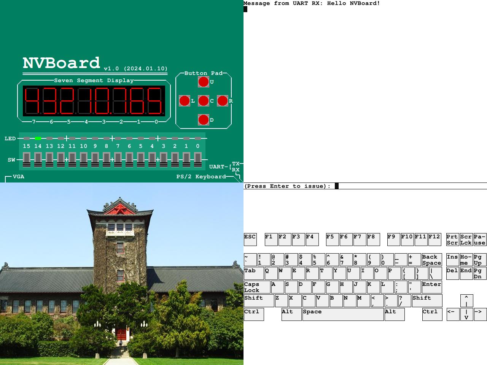

# NVBoard



## 介绍

NVBoard(NJU Virtual Board)是基于SDL开发的虚拟FPGA开发板，可以在Verilator仿真环境中模拟FPGA，支持LED，七段数码管，拨码开关，UART，键盘和VGA。

## 项目文件说明

```
.
├── board                   # 引脚说明文件
│   └── ...
├── example                 # 示例项目
│   └── ...
├── include                 # 用于NVboard项目内部包含的头文件
│   ├── component.h
│   ├── configs.h
│   ├── font.h
│   ├── keyboard.h
│   ├── macro.h
│   ├── nvboard.h
│   ├── pins.h
│   ├── render.h
│   ├── term.h
│   ├── uart.h
│   └── vga.h
├── resources
│   ├── font                # 字体资源
│   └── pic                 # 图片资源
├── scripts
│   ├── auto_pin_bind.py    # 生成引脚绑定代码的脚本
│   └── nvboard.mk          # NVBoard构建规则
├── src                     # NVBoard源码
│   ├── at_scancode.h
│   ├── button.cpp
│   ├── component.cpp
│   ├── event.cpp
│   ├── font.cpp
│   ├── keyboard.cpp
│   ├── led.cpp
│   ├── nvboard.cpp
│   ├── render.cpp
│   ├── segs7.cpp
│   ├── switch.cpp
│   ├── term.cpp
│   ├── timer.cpp
│   ├── uart.cpp
│   └── vga.cpp
├── usr
│   └── include           # 用于给外部项目包含的头文件
│       ├── nvboard.h
│       └── pins.h
├── LICENSE
└── README.md
```

## 安装教程

1. 将项目拷贝到本地，`git clone https://github.com/NJU-ProjectN/nvboard.git`
2. 通过`apt-get install libsdl2-dev libsdl2-image-dev libsdl2-ttf-dev`安装SDL2，SDL2-image和SDL2-ttf；对于`macOS`，可以通过`brew install sdl2 sdl2_image sdl2_ttf`安装
3. 把本项目的目录设置成环境变量`NVBOARD_HOME`

## 示例

`example`目录下包含一个示例项目，在该目录下通过 `make run` 命令可运行该项目。

## 接入verilator步骤

### API说明

NVBoard提供了以下几组API

- `void nvboard_init()`: 初始化NVBoard
- `void nvboard_quit()`: 退出NVBoard
- `void nvboard_bind_pin(void *signal, int len, ...)`: 将HDL的信号signal连接到NVBoard里的引脚上，具体地
  - `len`为信号的长度，大于1时为向量信号
  - 可变参数列表`...`为引脚编号列表，编号为整数；绑定向量信号时，引脚编号列表从MSB到LSB排列
- `void nvboard_update()`: 更新NVBoard中各组件的状态，每当电路状态发生改变时都需要调用该函数

### 引脚绑定

手动调用`nvboard_bind_pin()`来绑定所有引脚较为繁琐。
为了方便进行信号的绑定，NVBoard项目提供了一套从自定义约束文件生成绑定代码的流程。具体地
1. 编写一个自定义格式的约束文件，其格式为
```
top=top_name

# Line comment inside nxdc
signal pin
signal (pin1, pin2, ..., pink)
```
在约束文件的第一行，需要指定顶层模块名（上文中为`top_name`）。
约束文件支持两种信号绑定方式，`signal pin`表示将顶层模块的`signal`端口信号绑定到引脚`pin`上，
`signal (pin1, pin2, ..., pink)`表示将顶层模块的`signal`信号的每一位从高到低依次绑定到`pin1, pin2, ..., pink`上。
约束文件支持空行与行注释。

2. 通过命令`python $(NVBOARD_HOME)/scripts/auto_pin_bind.py nxdc约束文件路径 auto_bind.cpp输出路径`来生成C++文件。

调用该文件中的`nvboard_bind_all_pins(dut)`函数即可完成所有信号的绑定。

注意，该脚本的错误处理并不完善，若自定义约束文件中存在错误，则可能无法生成正确的报错信息与C++文件。
~~如果发现脚本中的错误也可以尝试修复一下然后丢pr~~

可以在`board`目录下的引脚说明文件中查看引脚信息。
其中`output`表示该信号方向为输出方向(从RTL代码到NVBoard)，`input`为输入方向(从NVBoard到RTL代码)。

目前引脚列表中不包含复位引脚`RST`，因为NVBoard在cpp文件中包含一些内部状态，仅复位RTL设计部分会使其与NVBoard状态不一致。
一个实现全系统复位效果的简单方法是退出NVBoard并重新运行。RTL设计的复位工作由verilator的wrapper完成，具体见`example/csrc/main.cpp`。

### 调用API

在C++仿真代码中调用NVBoard提供的API
```c++
#include <nvboard.h>

// ...
nvboard_bind_all_pins(&dut);
nvboard_init();

while (1) {
  // ...
  nvboard_update();
}

nvboard_quit();
```
具体地
* 在进入verilator仿真的循环前，先对引脚进行绑定，然后对NVBoard进行初始化
* 在verilator仿真的循环中更新NVBoard各组件的状态
* 退出verilator仿真的循环后，销毁NVBoard的相关资源

### 编译链接

在Makefile中
* 将生成的上述引脚绑定的C++文件加入源文件列表
* 将NVBoard的构建脚本包含进来
```
include $(NVBOARD_HOME)/scripts/nvboard.mk
```
* 通过`make nvboard-archive`生成NVBoard的库文件
* 在生成verilator仿真可执行文件(即`$(NVBOARD_ARCHIVE)`)将这个库文件加入链接过程，并添加链接选项`-lSDL2 -lSDL2_image`

可以参考示例项目中的Makefile文件，即`example/Makefile`
